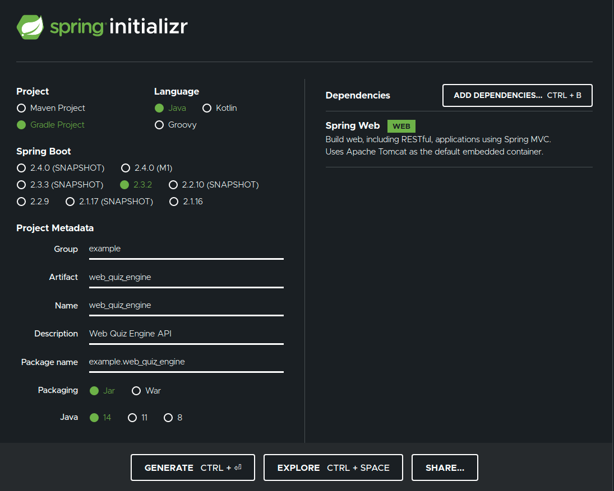

This project is modeled after the Web Quiz Engine project from [JetBrains Academy](https://hyperskill.org/).

# Lesson 1

## What this does

This is a service that will accept HTTP requests at http://localhost:8889/api/quiz.
The examples below use [httpie](https://httpie.org/) to demonstrate requests.

### GET

`http GET http://localhost:8889/api/quiz`

returns

```
{
  "title": "The Java Logo",
  "text": "What is depicted on the Java logo?",
  "options": ["Robot","Tea leaf","Cup of coffee","Bug"]
}
```

### POST

#### Correct answer

`http POST http://localhost:8889/api/quiz?answer=2`

returns

```
{
  "success": true,
  "feedback": "Congratulations, you're right!"
}
```

#### Incorrect answer

`http POST http://localhost:8889/api/quiz?answer=1` or any other value for answer

returns

```
{
  "success": false,
  "feedback": "Wrong answer! Please, try again."
}
```

## How to implement

### Spring Initialzr

Use [Spring Initialzr](https://start.spring.io/) to generate a starter project.



Settings:

- Gradle Project
- Java
- Spring Boot 2.3.2
- Metadata
  - Group: example
  - Artifact: web_quiz_engine
  - Name: web_quiz_engine
  - Description: Web Quiz Engine API
  - Package name: example.web_quiz_engine
  - Packaging: Jar
  - Java: 14
- Dependencies
  - Spring Web

### How to run

`gradle bootRun`
